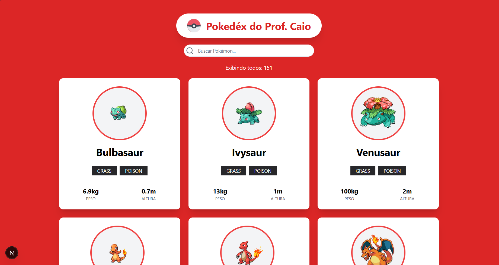

# Pokedex Next.js 15

Uma Pokedex moderna e performática desenvolvida para explorar as capacidades do **Next.js 15** com **Client-Side Rendering** otimizado. O projeto consome a [PokeAPI](https://pokeapi.co/) e oferece uma experiência de busca instantânea e fluida.

## Tecnologias

Este projeto foi desenvolvido utilizando a stack mais atual do mercado:

- **[Next.js 15](https://nextjs.org/)** (App Router)
- **[TypeScript](https://www.typescriptlang.org/)**
- **[TanStack Query](https://tanstack.com/query/latest)** (Gerenciamento de Estado e Cache)
- **[Tailwind CSS](https://tailwindcss.com/)** (Estilização)
- **[Lucide React](https://lucide.dev/)** (Ícones)
- **[PokeAPI](https://pokeapi.co/)** (Dados)

## Funcionalidades

- **Listagem de Pokémons:** Exibição dos 151 Pokémons originais (Geração 1) com sprites e nomes.
- **Busca Híbrida Inteligente:**
  - **Filtragem Client-Side:** Busca instantânea na memória (sem loading a cada letra).
  - **Sincronização via URL:** Ao dar "Enter", o termo de busca vai para a URL (`?q=nome`), permitindo compartilhar o link com o filtro ativo.

## Como rodar o projeto

1. Clone o repositório:
git clone [https://github.com/caioaugustofb/Pokedex.git](https://github.com/caioaugustofb/Pokedex.git)

2. Entre na pasta do projeto:
cd Pokedex

3. Instale as dependências:
npm install

4. Rode o servidor de desenvolvimento:
npm run dev

5. Abra o navegador em http://localhost:3000.

## Estrutura do Projeto
O projeto segue a arquitetura do Next.js App Router:

app/: Páginas e layouts (Server e Client Components).

components/: Componentes reutilizáveis (Input de busca, Cards, Listas).

hooks/: Custom Hooks (Lógica do React Query separada da UI).

lib/: Utilitários e configurações.

## Aprendizados
Durante o desenvolvimento, foram abordados conceitos importantes:

Diferença entre Server-Side Rendering (SSR) e Client-Side Rendering (CSR).

Implementação do React Query para performance e UX.

Manipulação de parâmetros de URL (useSearchParams) no Next.js 15.

Debouncing e controle de formulários no React.

--------------------------------------------------------------------------------------
Desenvolvido por Caio Augusto
